<base target="_blank">

<!-- _class: lead -->
<!-- _paginate: false -->

# 2026 東進武嶺

台大單車社武嶺大活動行前說明會

**6/19（五）— 6/21（日）· 三天兩夜**

2026-06-16

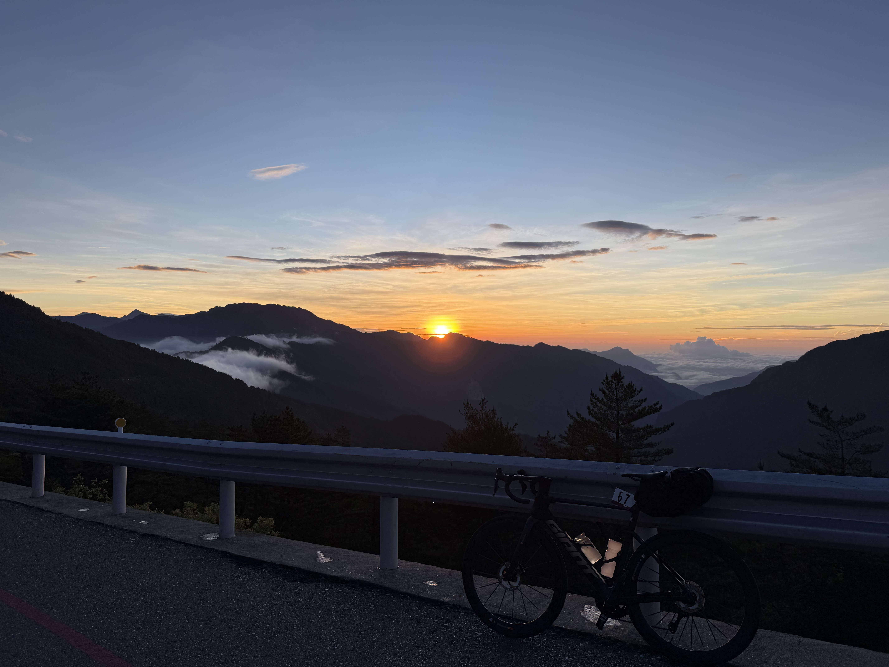

---

## 主辦 & 協辦

- **主辦**：許博翔（0921279856）
- **協辦**：陳冠衡（0902127112）

---

## 去程交通 & 集合（6/19）

- **272 次自強號**（需包車）：07:32 松山 → 10:28 新城
- **6:20** 台大正門集合
- **7:00** 松山車站會合
- **10:28** 新城車站會合
- 遲到直接放生，請務必準時

---

<!-- _class: lead -->

# 路線資訊

東進武嶺 · 6/19 — 6/21 · 兩晚住宿

---

## Day 1 路線（6/19）

- 路線：**新城 → 天祥**
- 距離：**21.2 km** · 爬升：**500 m**
- [Strava 路線](https://www.strava.com/routes/3501622353220525028)

---

## Day 1 注意事項

- **騎乘起點**：新城車站
- 出發後為自由騎乘，請事先確認 [Day 1 路線](https://www.strava.com/routes/3501622353220525028)
- **住宿**：[天祥青年活動中心](https://maps.app.goo.gl/WigYvbwXFGEmDhd6A)
- **16:30 前**通過綠水管制點

---

## Day 1 補給

- 大隊會在新城吃午餐，吃完再上山
- 太魯閣牌樓至天祥間無任何補給，請自行攜帶補給
- 晚餐可在天祥解決，天祥有竹筒飯、高麗菜、香腸等美食

---

## Day 1 景點

- 太魯閣遊客中心周邊
- 天祥周邊
- 太魯閣峽谷的鬼斧神工
- 砂卡礑、西拉岸、山月吊橋、錐麓古道、燕子口步道、九曲洞步道皆未開放

---

## Day 1 景點

<video src="photo/IMG_0652.mp4" controls muted loop playsinline autoplay style="width:250px; border-radius:6px;"></video>
<video src="photo/IMG_0654.mp4" controls muted loop playsinline autoplay style="width:250px; border-radius:6px;"></video>
<video src="photo/IMG_0656.mp4" controls muted loop playsinline autoplay style="width:250px; border-radius:6px;"></video>
<video src="photo/IMG_0657.mp4" controls muted loop playsinline autoplay style="width:250px; border-radius:6px;"></video>

---

## Day 1 路況

- 路上有不少棒球到足球大小的石頭，慢慢騎小心不要碾到
- 燕子口隧道出口（之前是堰塞湖）有很多石頭，務必小心

<video src="photo/IMG_0658.mp4" controls muted loop playsinline autoplay style="width:100%; max-height:500px; border-radius:6px;"></video>

---

## Day 2 路線（6/20）

- 路線：**天祥 → 關原**
- 距離：**52.25 km** · 爬升：**2300 m**
- [Strava 路線](https://www.strava.com/routes/3489054365249378784)

---

## Day 2 注意事項

- 住宿點可以訂早餐（\$150，不含在報名費中），要的人請在今晚23:59前在群組按表情
- **建議出發**：早上 8:00，需於**16:30前通過關原管制站**，太晚出發直接放生
- **一定要吃早餐！** 沿途沒有補給
- 出發時**水要裝滿**
- **住宿**：[救國團觀雲山莊](https://maps.app.goo.gl/Q21XFDdxZwNzvxmk8)

---

## Day 2 補給

- 離開天祥之後，到關原才有補給，沿途的雜貨店可能都沒有開
- 關原加油站有賣粽子（\$50/顆）與美式，但是是限量的，騎快一點才有
- 請自行攜帶果膠（一人10條）
- 午餐需自行解決（第一天山下買好/早點騎到關原加油站吃粽子）

---

## Day 2 景點

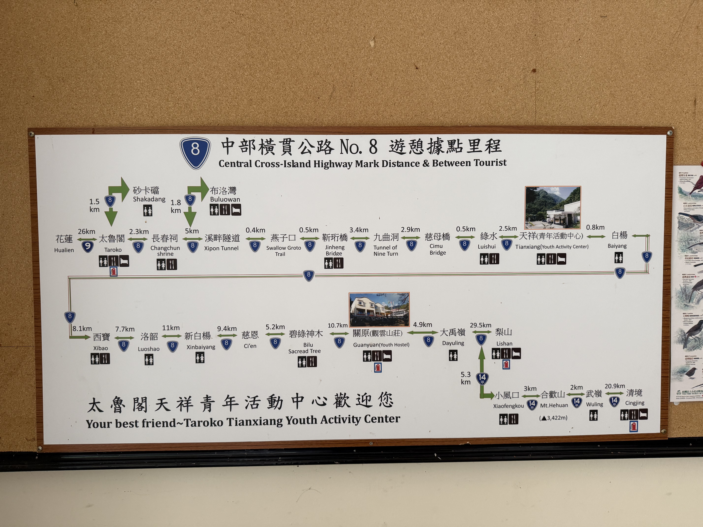

---

## Day 2 景點

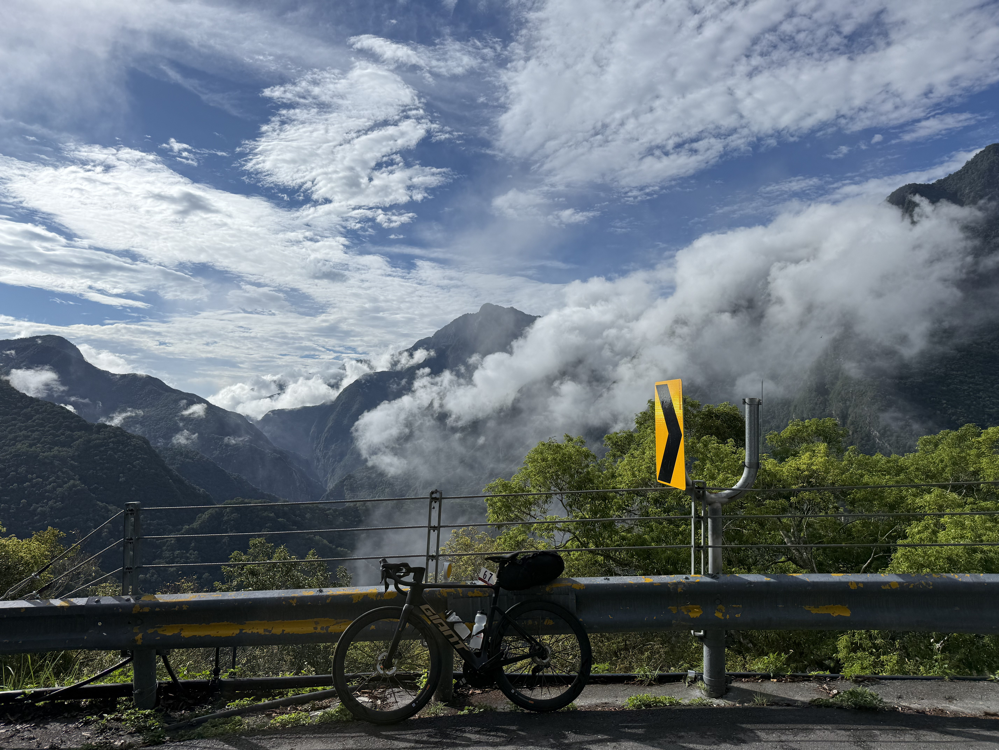 

---

## Day 2 景點

<video src="photo/IMG_0696.mp4" controls muted loop playsinline autoplay style="width:280px; border-radius:6px;"></video>
<video src="photo/IMG_0708.mp4" controls muted loop playsinline autoplay style="width:280px; border-radius:6px;"></video>
<video src="photo/IMG_0709.mp4" controls muted loop playsinline autoplay style="width:280px; border-radius:6px;"></video>

---

## Day 2 路況

- 除了快到關原管制站前兩公里外，其餘路況良好

---

## Day 2 晚餐

估計大賽：
$$\frac{\text{左邊的價格}}{\text{右邊的價格}}$$
最接近多少？

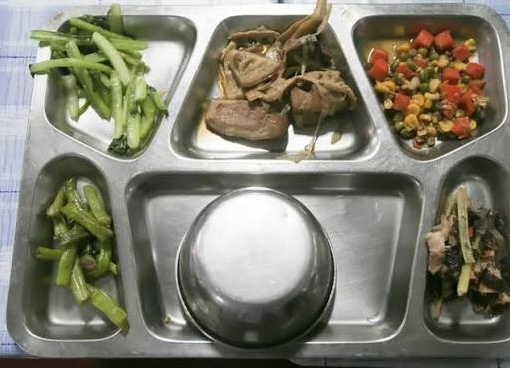
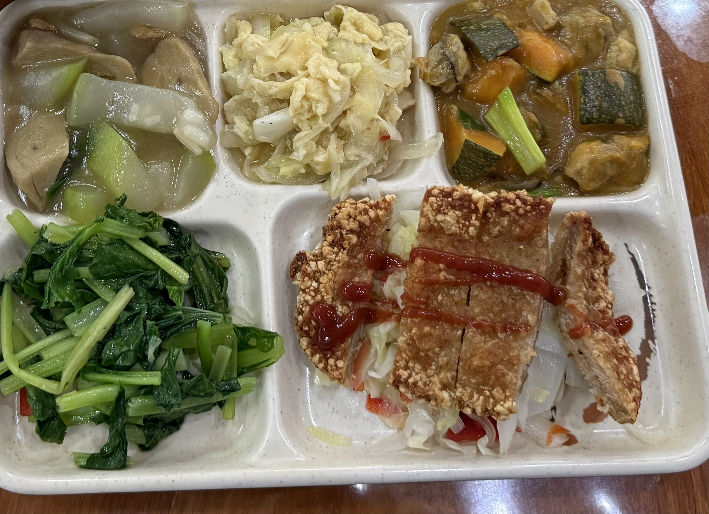

---

## Day 2 晚餐

- 一碗 \$70 的泡麵
- 住宿點可以訂晚餐（\$???，不含在報名費中），要的人請在今晚 23:59 前在群組按表情
- 關原加油站肉粽（騎快的才有）

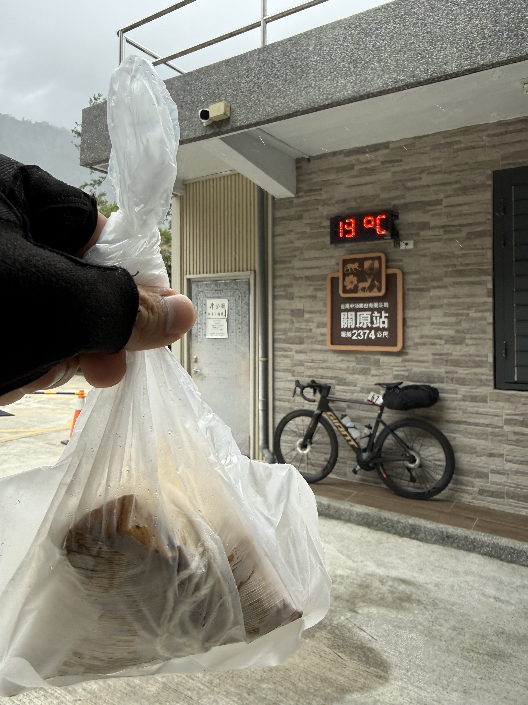
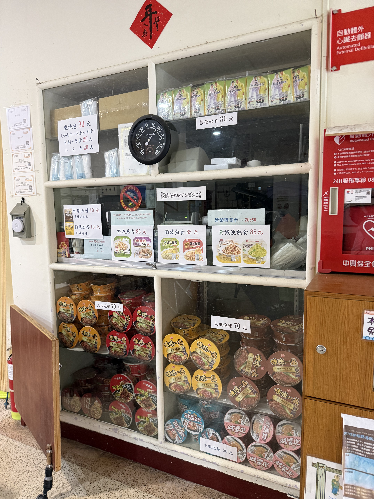

---

## Day 3 路線（6/21）

- 路線：**關原 → 武嶺 → 埔里**
- 距離：**69.0 km** · 爬升：**1044 m**
- [Strava 路線](https://www.strava.com/routes/3489054672525609440)
- 抵達埔里後自行安排回程交通

---

## Day 3 注意事項

- 自 [救國團觀雲山莊](https://maps.app.goo.gl/Q21XFDdxZwNzvxmk8)（關原）出發
- （正常）出發時間：早上8:30，住宿點7:30有提供早餐
- 大禹嶺—武嶺非常陡，小心不要定竿；快定竿時下來牽車比摔車好
- 到武嶺後自行解散，可跟大隊下滑至埔里

---

## Day 3 日出加碼團

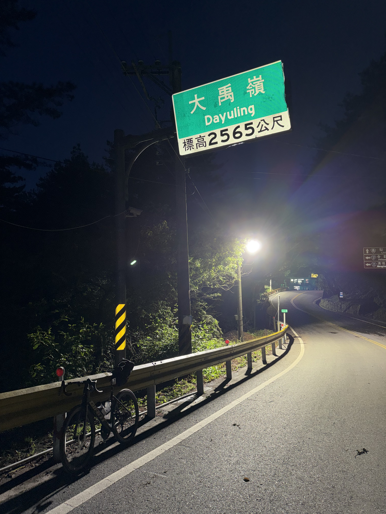

---

## Day 3 日出加碼團

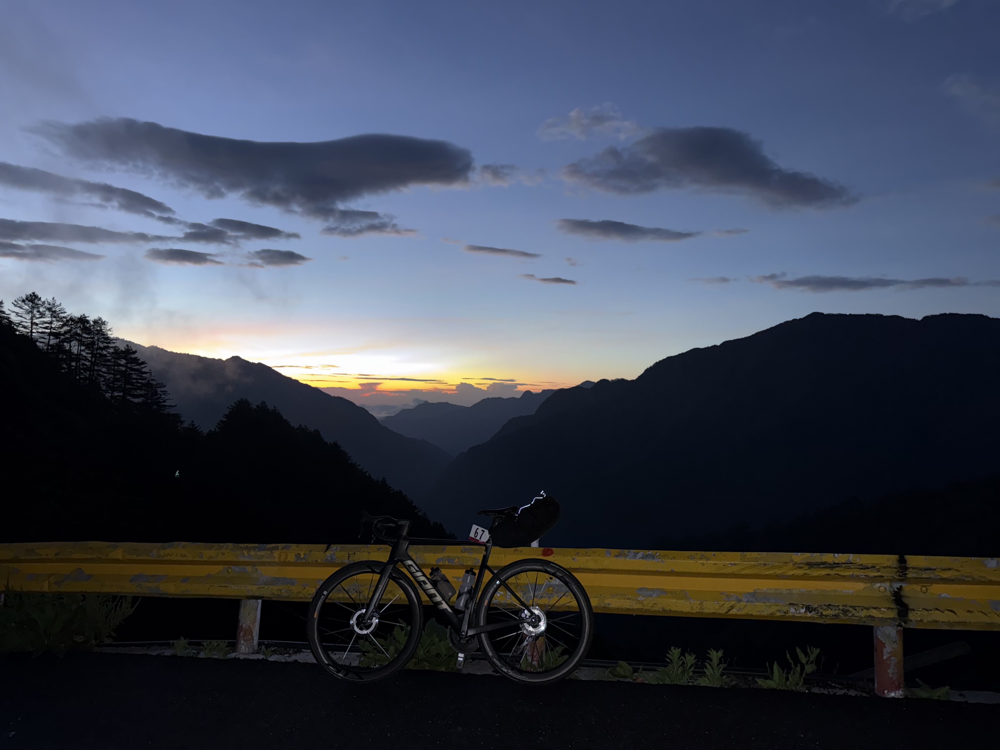
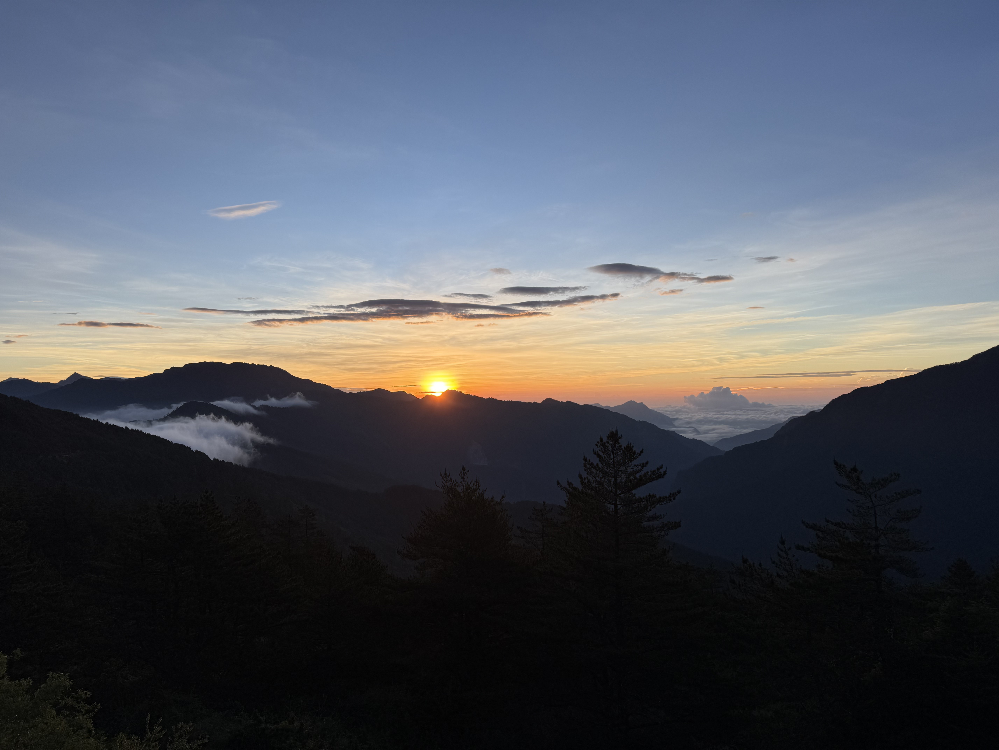

---

## Day 3 日出加碼團

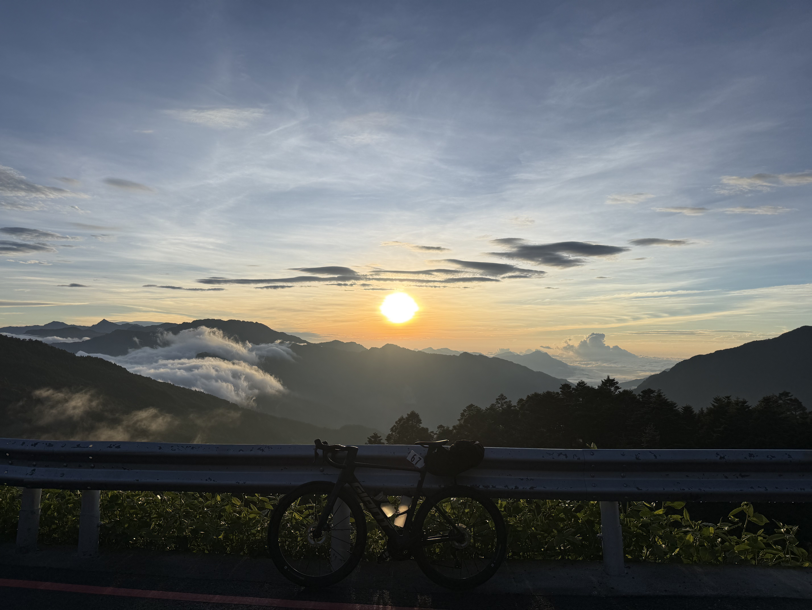
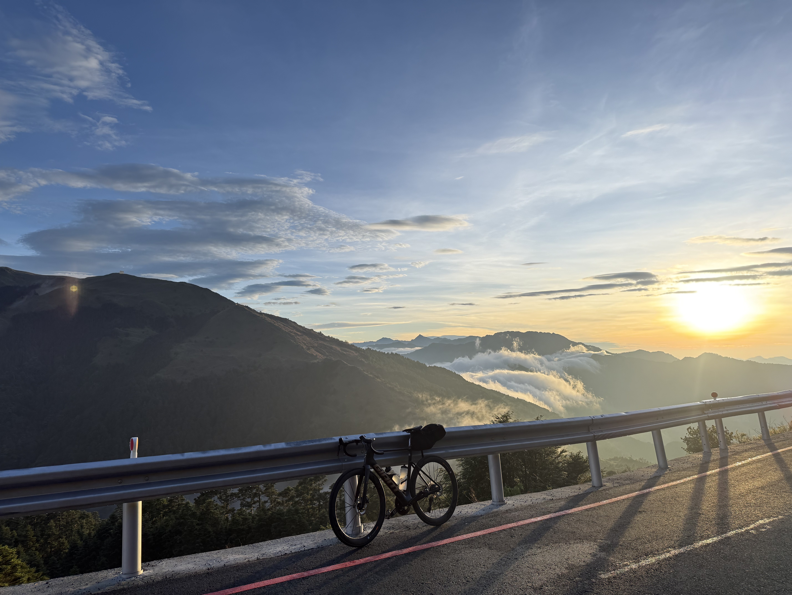

---

## Day 3 日出加碼團

- 日出時間：5:04
- 觀看日出地點：小風口至石門山
- 出發時間：3:30
- 務必攜帶前後燈
- 看完日出（5:30）會上武嶺（6:30）拍照，再下滑回關原吃早餐（7:30）

---

## Day 3 補給

- 大禹嶺（可能有人賣水果，有廁所）
- 合歡山管理站（小風口）（便當 180、雞塊 70、威德 50）
- 松雪樓

---

## Day 3 景點

- 石門山
- 合歡東峰
- 合歡主峰

---

## Day 3 路況

- 關原至大禹嶺，以及小風口至海拔 3000 公尺，這兩段有些地方在施工
- 其餘路段路況良好

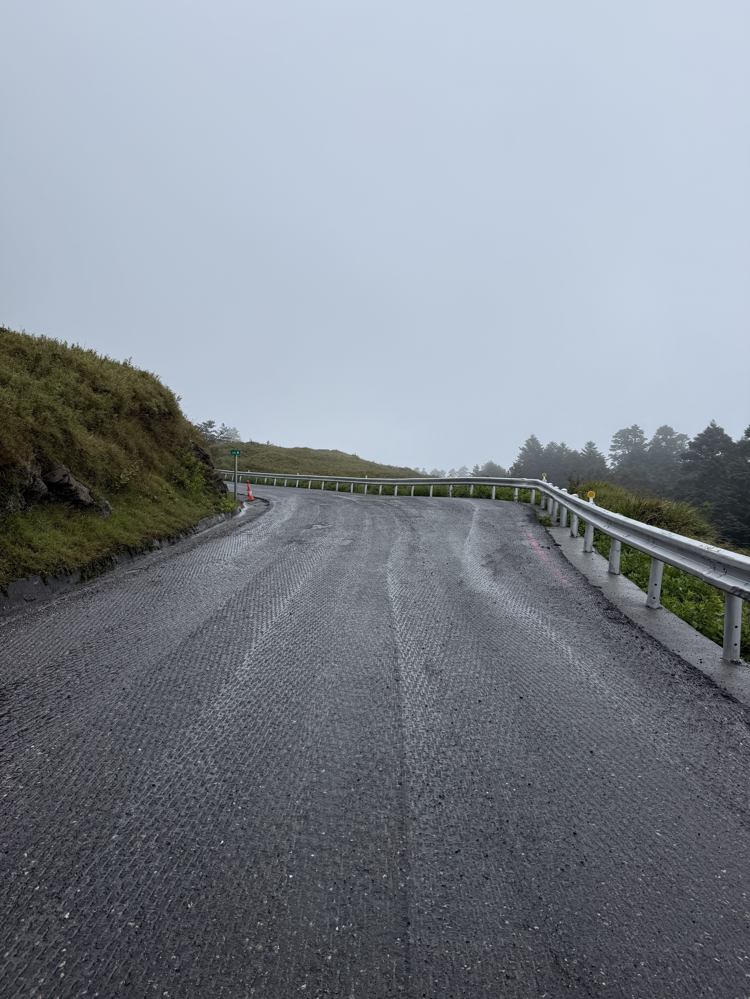

---

## 回程交通

- 下滑至埔里
- 下滑至梨山 / 宜蘭
- 自行叫車
- （加碼台灣屋脊）

---

## 下滑至埔里

- 大隊會帶到埔里轉運站
- 埔里有客運可到台中、台北
- 轉運站包車規定較嚴：只拆單輪需加價，且有多餘行李空位才上車
- **強烈建議拆雙輪**

---

## 下滑至梨山 / 宜蘭

- 梨山—宜蘭／羅東有客運，需騎很快；末班約 13:30（請查當日班表）
- 沿原路下滑回宜蘭約 150 公里，新手不宜

---

## 自行叫車

- 可事先找司機從武嶺載回家
- 一台車價格通常固定，一人與多人總費相同
- 有需求者可開始揪團

---

<!-- _class: lead -->

# 行前準備

---

## 食

- 補充水、糖分、電解質、高熱量、少油
- 早中晚餐自行覓食；沿途補給不多，遇雜貨店可稍停
- 可帶果膠、威德等補給品

---

## 衣

- **頭**：安全帽必備；（頭巾、小帽、風鏡）
- **上身**：車衣、排汗衣物、輕薄／防水外套（高山冷，勿穿塑膠雨衣）
- **下身**：車褲或運動褲；普通長褲請用綁腿固定褲管
- **鞋**：硬底鞋或卡鞋

---

## 住

- **三天兩夜**：Day 1 天祥、Day 2 關原（觀雲山莊）
- 盥洗用具（牙膏、牙刷等）
- 衣服不用多：一套騎乘、一套睡覺即可
- **嚴禁晚上自行出去騎車**

---

## 物品清單（1/3）

- **穿**：安全帽、車衣車褲、襪子、（手套、風鏡、卡鞋、心率帶）
- **口袋**：小錢包、面紙、（扣片保護套）
- **車**：水壺×2、前燈、後燈、（車錶）

---

## 物品清單（2/3）

- **包**：風衣、內衣褲、睡衣、毛巾、牙刷牙膏、衛生紙、塑膠袋、（洗衣袋）
- 充電頭、充電線、行充、拖鞋、大錢包、鑰匙
- 果膠或燕麥棒、攜車袋、內胎
- （打氣筒、挖胎棒等若無可略，壓隊有修車工具）

---

## 物品清單（3/3）

- **預先充電**：手機、手錶、前後燈、行充、（功率計、車錶）
- 無安全帽、攜車袋請事前向單車社借
- 租借社車者，社團提供內胎
- 擔心背包太重可購蟲蛹包（一般 6L 足夠，如 Topeak）

---

## 分享位置資訊

- 全程自由騎乘，請事先確認 Day 1–3 Strava 路線
- 加碼請事先告知主辦，並確保體力與時間可行；**Day 1、Day 2 須 16:30 前到住宿點**
- 活動期間全程 [Google Map 分享位置](https://hackmd.io/@701-Coder/shareLocation)（每天需重開，解散後可關）

---

<!-- _class: lead -->

# 騎乘技巧

---

## 基本技巧

- **平路**：自然放鬆，維持穩定踩踏節奏
- **爬坡**：稍往前坐，節奏可放慢
- **下坡**：稍往後坐，前後煞車一起壓（入彎前多加，不可鎖死）
- **總結**：切勿頻繁重踩（傷膝），隨時補充水分

---

## 下坡 & 雨騎

- 下坡教學：[「K2」你該如何下坡？](https://www.youtube.com/watch?v=hsxfW376nR4)
- **雨騎／地濕**：降速、頻繁點煞排水、注意路況、避白／黃／紅線、煞車不可鎖死

---

## 團騎要領

- 轉彎、停止前確認後方；煞車不可鎖死
- 遇異物示意後方再繞過
- **不准**並排、放雙手、戴耳機
- 爆胎或事故留一人等壓隊
- 下坡留三台車以上安全距離
- 一切以安全為優先

---

## 小心貓眼

---

## 車檢 & 教學

- **傳動／煞車／車輪／車架／人身**：出發前自行檢查
- 攜車袋：[4 分鐘速成教學](https://youtu.be/UnZ3hp1-kSA)
- 爆胎：[更換公路車開口胎](https://www.youtube.com/watch?v=dDNxaGbMbBo)

---

## 天氣預報

待補

---

<!-- _class: lead -->
<!-- _paginate: false -->

# 6/19 見

6:20 台大正門 · 7:00 松山 · 10:28 新城

Questions?
